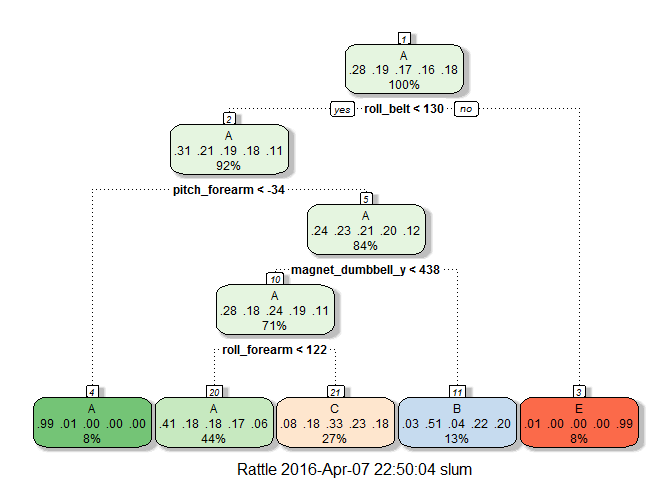

# Using Random Forest to Predict Correct Barbell Lifts from Wearable Accelerometer Data
Stephanie Lum  
April 7, 2016  

This is the final course project for the Practical Machine Learning class taught by Johns Hopkins University as part of the Data Science specialization offered by Coursera.

##Introduction

This report investigates the relationship between data collected by wearble devices such as *Jawbone Up*, *Nike FuelBand*, and *Fitbit*, and the ability to correctly perform barbell lifts. Six participants were asked to perform barbell lifts correctly and incorrectly in five different ways while wearing accelerometers on their belts, forearms, and arms. Various machine learning methods will be applied to the data collected from those accelerometers to build models to predict how the barbell lifts were performed (coded as A to E in the dataset, with A as the lift being performed correctly).

##Data

The training data can be downloaded from [here](https://d396qusza40orc.cloudfront.net/predmachlearn/pml-training.csv).  
The testing data can be downloaded from [here](https://d396qusza40orc.cloudfront.net/predmachlearn/pml-testing.csv).  
The source for both datasets, as well as the original research paper, can be found here: http://groupware.les.inf.puc-rio.br/har

###Loading the Data

The following packages were used in this investigation:


```r
library(caret)
library(randomForest)
library(rpart)
library(rattle)
```

Both the training set and the testing set are downloaded and loaded.


```r
# Check to see if training and testing files exist. If not, downloads them
if (!file.exists("training.csv")) {
      fileURL <- "https://d396qusza40orc.cloudfront.net/predmachlearn/pml-training.csv"
      download.file(fileURL, destfile = "training.csv")
}

if (!file.exists("testing.csv")) {
      fileURL <- "https://d396qusza40orc.cloudfront.net/predmachlearn/pml-testing.csv"
      download.file(fileURL, destfile = "testing.csv")
}

# Load training and testing data
training <- read.csv("training.csv", na.strings = c("NA", "#DIV/0!", ""))
test_cases <- read.csv("testing.csv", na.strings = c("NA", "#DIV/o!", ""))
```

###Preprocessing

After the data is loaded in, it is necessary to remove all the variables that only contain more than 75% **NA** or **NA** and **0** value observations. The first seven variables of the dataset are also removed, as they will not contribute to the prediction model.


```r
# Remove columns that are more than 75% NAs or NAs and 0s
training <- training[,colSums(training != 0, na.rm = TRUE) > nrow(training) * .75]

# Remove the first seven variables from the dataset
training <- training[,8:length(colnames(training))]
```

Next, the data is tested to see if there are any near zero covariates, as they are not helpful in predicting. If there are any near zero covariates, that variable will be removed in order to simplify the model and to reduce noise.


```r
# Find the near zero covariates
nzo <- nearZeroVar(training, saveMetrics = FALSE)
sum(nzo)
```

```
## [1] 0
```

It seems there are no near zero covariates, and thus there are no variables that need to be removed.     

##Training

First, the training data is partitioned into an additional training set to build the model and a testing set to use for cross validation after training the model.


```r
set.seed(8675309)

inTrain <- createDataPartition(training$classe, p = 0.75, list = FALSE)
train <- training[inTrain, ]
test <- training[-inTrain, ]
```

The recursive partitioning and regression trees method and the random forest method will be applied to these partitioned datasets. Their accuracy and error rate will then be assessed in the cross-validation test set to determine which model has the better fit.

###Recursive Partitioning and Regression Trees

The first method is a classification tree.


```r
set.seed(8675309)

model_rpart <- train(classe ~ ., data = train, method = "rpart")
fancyRpartPlot(model_rpart$finalModel)
```



This model is then applied to the cross-validation test set, and a confusion matrix is generated.


```r
predict_rpart <- predict(model_rpart, test)
confusionMatrix(predict_rpart, test$classe)
```

```
## Confusion Matrix and Statistics
## 
##           Reference
## Prediction    A    B    C    D    E
##          A 1255  408  403  373  124
##          B   32  300   34  141  112
##          C  103  241  418  290  245
##          D    0    0    0    0    0
##          E    5    0    0    0  420
## 
## Overall Statistics
##                                           
##                Accuracy : 0.488           
##                  95% CI : (0.4739, 0.5021)
##     No Information Rate : 0.2845          
##     P-Value [Acc > NIR] : < 2.2e-16       
##                                           
##                   Kappa : 0.3306          
##  Mcnemar's Test P-Value : NA              
## 
## Statistics by Class:
## 
##                      Class: A Class: B Class: C Class: D Class: E
## Sensitivity            0.8996  0.31612  0.48889   0.0000  0.46615
## Specificity            0.6272  0.91934  0.78291   1.0000  0.99875
## Pos Pred Value         0.4897  0.48465  0.32228      NaN  0.98824
## Neg Pred Value         0.9402  0.84854  0.87885   0.8361  0.89261
## Prevalence             0.2845  0.19352  0.17435   0.1639  0.18373
## Detection Rate         0.2559  0.06117  0.08524   0.0000  0.08564
## Detection Prevalence   0.5226  0.12622  0.26448   0.0000  0.08666
## Balanced Accuracy      0.7634  0.61773  0.63590   0.5000  0.73245
```

From the confusion matrix, the overall accuracy of the classification tree model is **48.8%**.

###Random Forest

Next, the random forest method is used, and a model is generated and applied to the cross-validation test set.


```r
set.seed(8675309)

model_rf <- randomForest(classe ~ ., data = train, trControl = trainControl(method = "cv"))
print(model_rf)
```

```
## 
## Call:
##  randomForest(formula = classe ~ ., data = train, trControl = trainControl(method = "cv")) 
##                Type of random forest: classification
##                      Number of trees: 500
## No. of variables tried at each split: 7
## 
##         OOB estimate of  error rate: 0.5%
## Confusion matrix:
##      A    B    C    D    E  class.error
## A 4184    1    0    0    0 0.0002389486
## B    7 2836    5    0    0 0.0042134831
## C    0   20 2543    4    0 0.0093494351
## D    0    0   25 2385    2 0.0111940299
## E    0    0    2    7 2697 0.0033259424
```


```r
predict_rf <- predict(model_rf, test)
confusionMatrix(predict_rf, test$classe)
```

```
## Confusion Matrix and Statistics
## 
##           Reference
## Prediction    A    B    C    D    E
##          A 1394    4    0    0    0
##          B    0  942    6    0    0
##          C    0    3  849    5    0
##          D    0    0    0  798    5
##          E    1    0    0    1  896
## 
## Overall Statistics
##                                           
##                Accuracy : 0.9949          
##                  95% CI : (0.9925, 0.9967)
##     No Information Rate : 0.2845          
##     P-Value [Acc > NIR] : < 2.2e-16       
##                                           
##                   Kappa : 0.9936          
##  Mcnemar's Test P-Value : NA              
## 
## Statistics by Class:
## 
##                      Class: A Class: B Class: C Class: D Class: E
## Sensitivity            0.9993   0.9926   0.9930   0.9925   0.9945
## Specificity            0.9989   0.9985   0.9980   0.9988   0.9995
## Pos Pred Value         0.9971   0.9937   0.9907   0.9938   0.9978
## Neg Pred Value         0.9997   0.9982   0.9985   0.9985   0.9988
## Prevalence             0.2845   0.1935   0.1743   0.1639   0.1837
## Detection Rate         0.2843   0.1921   0.1731   0.1627   0.1827
## Detection Prevalence   0.2851   0.1933   0.1748   0.1637   0.1831
## Balanced Accuracy      0.9991   0.9956   0.9955   0.9957   0.9970
```

From the confusion matrix, the overall accuracy of the random forest model is **99.5%**

###Method Selection

With an accuracy of **99.5%** and an error rate of **0.5%**, the random forest method will be used to predict the `classe` values on the testing data.

##Application

The random forest method will be applied to the testing dataset to predict the `classe` values.


```r
predict_test <- predict(model_rf, test_cases)
result <- data.frame("TestCase" = c(1:20), "Classe" = predict_test)
print(result, row.names = FALSE)
```

```
##  TestCase Classe
##         1      B
##         2      A
##         3      B
##         4      A
##         5      A
##         6      E
##         7      D
##         8      B
##         9      A
##        10      A
##        11      B
##        12      C
##        13      B
##        14      A
##        15      E
##        16      E
##        17      A
##        18      B
##        19      B
##        20      B
```
